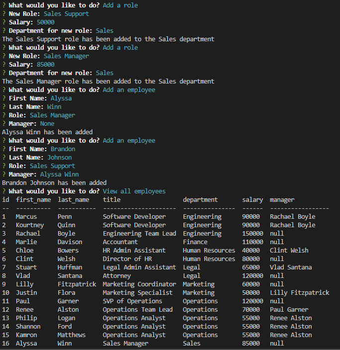
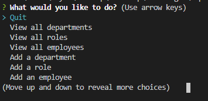

# Employee Tracker

## Description
A Node.js command-line application where a user can view information about the employees and their roles in different departments. They can also add new employees and update roles of employees all in one place.

## Table of Contents
  * [Installation](#installation)
  * [Usage](#usage)
  * [License](#license)
  * [Contributing](#contributing)
  * [Tests](#tests)
  * [Screenshots](#screenshots)
  * [Questions](#questions)

  ## Installation
  To use this application, you will need to clone the repository found [here](https://github.com/alyssawinn/employee-tracker), download Node to your local machine, install Inquirer and MySql using the command 'npm install inquirer mysql2' in your terminal. This will add the necessary node_modules folder and ability to do SQL in the terminal. To add the current database to the program, type 'sql -u root -p' into the terminal and click enter. Create the database and associated tables & data by entering the following 3 commands consecutively: source db/db.sql; source db/schema.sql; source db/seeds.sql;. Once that's complete, you can type 'node index.js' in the terminal to open the application.

  ## Usage
  Click [here](https://drive.google.com/file/d/1uywYy0GA8zNbmcsgDZOdFe12zauOCBZk/view) to open instructional video on how to follow prompts to view, add, and update employees.
  
  ## License
  No licenses are required for this project

  ## Contributing
  N/A

  ## Tests
  N/A

  ## Screenshots
  

  

  ## Questions
  If you have any questions, please contact me at [alyssawinn2@gmail.com](mailto:alyssawinn2@gmail.com) or visit my GitHub page [here](https://github.com/alyssawinn/)